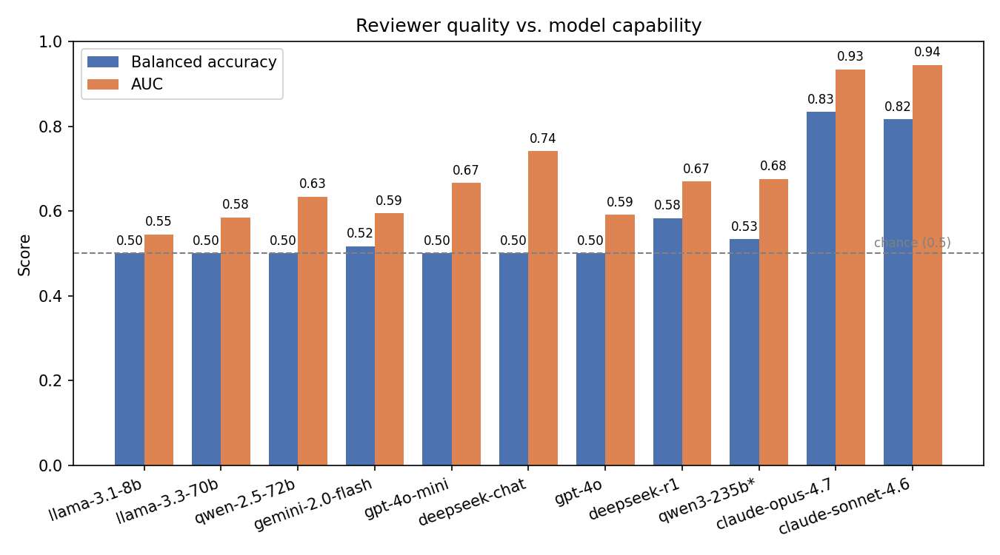
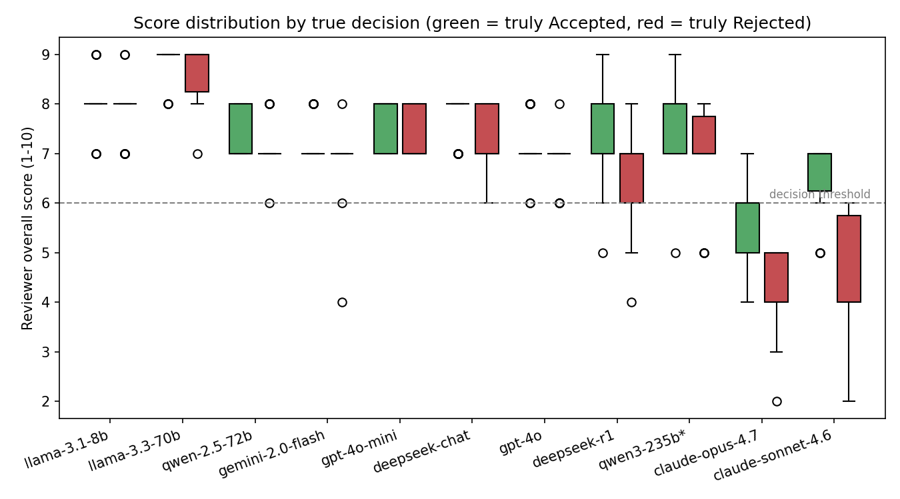
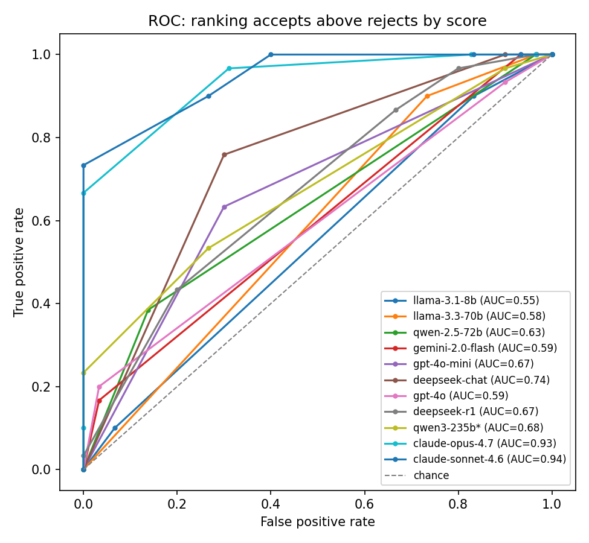

# Automated Reviewer — a recreation of the Automated Reviewer from *The AI Scientist*

A follow-up study for CS 162. We recreate the **Automated Reviewer** component of
Lu et al., *"Towards end-to-end automation of AI research"* (Nature 651, 2026 —
"The AI Scientist"), and use it to ask a question the paper raises but does not
isolate: **how does an LLM's ability to peer-review a paper scale with model
capability?**

We prompt a range of LLMs — open-source through frontier — to act as conference
reviewers on real ICLR submissions, and score their accept/reject judgements
against the venue's published decisions.

> **Headline result:** three distinct tiers emerge across 11 models. Seven models
> collapse to accepting *every* paper — including GPT-4o. Two reasoning models
> (deepseek-r1, qwen3-235b) partially break the pattern without reaching
> significance. Only **Claude Opus 4.7** and **Claude Sonnet 4.6** achieve
> genuinely calibrated reviews: Opus reaches balanced accuracy **0.833** (AUC
> **0.934**, FPR **0.000**); Sonnet reaches **0.817** (AUC **0.944**, FPR
> **0.267**). Both Anthropic models produce 95% CIs entirely above chance.
> The two models differ strikingly in error profile: Opus never accepts a bad
> paper; Sonnet rarely misses a good one.

---

## 1. Methodology

### 1.1 Data

- **Source:** ICLR 2024 submissions via the **OpenReview API**. ICLR is the only
  major ML venue that publishes *both* accept and reject decisions, which gives
  us ground-truth labels.
- **Sample:** **60 papers, balanced 30 Accept / 30 Reject.** Of 7,404 ICLR 2024
  submissions, 5,780 have a public decision; we sampled from those. Balancing
  makes plain accuracy interpretable, though it changes the base rate (real
  ICLR acceptance is ~30%) — see Limitations.
- **Input:** the **full extracted paper text** (via `pypdf`). When a paper
  exceeds a model's context window it is **tail-truncated** (head kept,
  appendix dropped).

### 1.2 Reviewer design

Each paper is sent to an LLM prompted with **NeurIPS-style reviewer
guidelines**. The model returns a strict JSON review:

| Field | Scale |
|---|---|
| `soundness`, `presentation`, `contribution` | integer 1–4 |
| `overall` | integer 1–10 |
| `confidence` | integer 1–5 |
| `decision` | `Accept` / `Reject` |
| `summary`, `strengths`, `weaknesses`, `questions`, `limitations` | free text |

**Decision rule:** `Accept` iff `overall ≥ 6` (the model also emits its own
verdict; we keep it consistent with the score).

The pipeline also supports a **5-review ensemble + area-chair meta-review** (the
paper's full design). Results below use **1 review per paper** — the ensemble is
the planned next step.

### 1.3 Models evaluated

A capability ladder, weak → strong, all run through OpenRouter. `*` marks
reasoning / thinking models.

| Model | Tier |
|---|---|
| `llama-3.1-8b-instruct` | small open-source |
| `llama-3.3-70b-instruct` | mid open-source |
| `qwen-2.5-72b-instruct` | mid open-source |
| `gemini-2.0-flash` | mid, Google |
| `gpt-4o-mini` | mid, OpenAI |
| `deepseek-chat` (DeepSeek V3) | strong open-source |
| `gpt-4o` | strong frontier, OpenAI |
| `deepseek-r1` * | strong open-source reasoning |
| `qwen3-235b` * | strong Qwen reasoning / thinking |
| `claude-sonnet-4.6` | frontier, Anthropic |
| `claude-opus-4.7` | frontier, Anthropic |

### 1.4 Metrics

Computed against ground truth with `Accept` as the positive class: **accuracy,
balanced accuracy** (mean of per-class recall — robust to imbalance),
**precision, recall, F1, AUC** (threshold-free score ranking), **FPR/FNR**, plus
a 5,000-resample bootstrap 95% CI on balanced accuracy.

---

## 2. How to reproduce

```bash
# 1. Install
python3 -m venv .venv && source .venv/bin/activate
pip install -r requirements.txt

# 2. API key — copy .env.example to .env and add OPENROUTER_API_KEY
cp .env.example .env        # then edit .env

# 3. Fetch 60 balanced ICLR 2024 papers (no API key needed for this step)
python -m automated_reviewer.fetch --n 60 --balanced

# 4. Run the reviewer for each model (all via OpenRouter)
python -m automated_reviewer.review --provider openrouter \
    --model meta-llama/llama-3.1-8b-instruct \
    --out results/reviews_meta-llama_llama-3.1-8b-instruct.json

python -m automated_reviewer.review --provider openrouter \
    --model meta-llama/llama-3.3-70b-instruct \
    --out results/reviews_llama-3.3-70b.json

python -m automated_reviewer.review --provider openrouter \
    --model qwen/qwen-2.5-72b-instruct --max-chars 80000 \
    --out results/reviews_qwen_qwen-2.5-72b-instruct.json

python -m automated_reviewer.review --provider openrouter \
    --model google/gemini-2.0-flash-001 \
    --out results/reviews_google_gemini-2.0-flash.json

python -m automated_reviewer.review --provider openrouter \
    --model openai/gpt-4o-mini \
    --out results/reviews_openai_gpt-4o-mini.json

python -m automated_reviewer.review --provider openrouter \
    --model deepseek/deepseek-chat \
    --out results/reviews_deepseek_deepseek-chat.json

python -m automated_reviewer.review --provider openrouter \
    --model openai/gpt-4o --budget 5.0 \
    --out results/reviews_openai_gpt-4o.json

python -m automated_reviewer.review --provider openrouter \
    --model deepseek/deepseek-r1 \
    --out results/reviews_deepseek_deepseek-r1.json

python -m automated_reviewer.review --provider openrouter \
    --model qwen/qwen3-235b-a22b-thinking-2507 \
    --out results/reviews_qwen_qwen3-235b-thinking.json

python -m automated_reviewer.review --provider openrouter \
    --model anthropic/claude-sonnet-4.6 --budget 0 \
    --out results/reviews_anthropic_claude-sonnet-4.6.json

python -m automated_reviewer.review --provider openrouter \
    --model anthropic/claude-opus-4.7 --budget 0 \
    --out results/reviews_anthropic_claude-opus-4.7.json

# 5. Score each run
python -m automated_reviewer.evaluate \
    --reviews results/reviews_<model>.json \
    --out results/metrics_<model>.json

# 6. Generate figures + combined table
python -m automated_reviewer.make_figures
```

---

## 3. Results

### 3.1 Main comparison

`*` = reasoning / thinking model.

| Model | n | Balanced acc. | 95% CI | Accuracy | AUC | F1 | FPR | FNR |
|---|---|---|---|---|---|---|---|---|
| llama-3.1-8b | 60 | 0.500 | [0.50, 0.50] | 0.500 | 0.545 | 0.667 | 1.00 | 0.00 |
| llama-3.3-70b | 60 | 0.500 | [0.50, 0.50] | 0.500 | 0.585 | 0.667 | 1.00 | 0.00 |
| qwen-2.5-72b | 55 | 0.500 | [0.50, 0.50] | 0.473 | 0.634 | 0.642 | 1.00 | 0.00 |
| gemini-2.0-flash | 60 | 0.517 | [0.50, 0.55] | 0.517 | 0.594 | 0.674 | 0.97 | 0.00 |
| gpt-4o-mini | 60 | 0.500 | [0.50, 0.50] | 0.500 | 0.667 | 0.667 | 1.00 | 0.00 |
| deepseek-chat (V3) | 59 | 0.500 | [0.50, 0.50] | 0.492 | **0.741** | 0.659 | 1.00 | 0.00 |
| gpt-4o | 60 | 0.500 | [0.50, 0.50] | 0.500 | 0.591 | 0.667 | 1.00 | 0.00 |
| deepseek-r1 * | 60 | 0.583 | [0.49, 0.68] | 0.583 | 0.669 | 0.684 | 0.73 | 0.10 |
| qwen3-235b * | 60 | 0.533 | [0.47, 0.60] | 0.533 | 0.676 | 0.674 | 0.90 | 0.03 |
| **claude-sonnet-4.6** | **60** | **0.817** | **[0.72, 0.91]** | **0.817** | **0.944** | **0.831** | **0.27** | **0.10** |
| **claude-opus-4.7** | **59** | **0.833** | **[0.74, 0.92]** | **0.831** | **0.934** | **0.800** | **0.00** | **0.33** |

*n < 60 for some models — see Section 5 (Limitations) for per-model reasons.*

### 3.2 Figures

**Reviewer quality vs. model capability** — balanced accuracy is pinned at 0.50
for seven models; the two reasoning models edge upward without reaching
significance; both Anthropic models break decisively above chance.



**Score distribution by true decision** — green = truly Accepted, red = truly
Rejected. Most models pile every paper above the dashed threshold. Only
deepseek-r1, qwen3-235b, claude-sonnet-4.6, and claude-opus-4.7 produce scores
below it — and only the Anthropic models show clean separation between classes.



**ROC curves** — how well each model's raw score ranks accepts above rejects.
`deepseek-chat` leads among non-reasoning models (AUC 0.74); Sonnet reaches
0.944 and Opus 0.934.



### 3.3 Decisions and score behaviour

| Model | Confusion (TP/FP/FN/TN) | Decisions | Mean `overall` | Score range |
|---|---|---|---|---|
| llama-3.1-8b | 30 / 30 / 0 / 0 | 60/60 Accept | 7.95 | 7–9 |
| llama-3.3-70b | 30 / 30 / 0 / 0 | 60/60 Accept | 8.80 | 7–9 |
| qwen-2.5-72b | 26 / 29 / 0 / 0 | 55/55 Accept | 7.24 | 6–8 |
| gemini-2.0-flash | 30 / 29 / 0 / 1 | 1 Reject | 7.03 | 4–8 |
| gpt-4o-mini | 30 / 30 / 0 / 0 | 60/60 Accept | 7.47 | 7–8 |
| deepseek-chat | 29 / 30 / 0 / 0 | 59/59 Accept | 7.47 | 6–8 |
| gpt-4o | 30 / 30 / 0 / 0 | 60/60 Accept | 7.03 | 6–8 |
| deepseek-r1 * | 27 / 22 / 3 / 8 | 11 Reject (8 correct) | 6.97 | 4–9 |
| qwen3-235b * | 29 / 27 / 1 / 3 | 4 Reject (3 correct) | 7.38 | 5–9 |
| **claude-sonnet-4.6** | **27 / 8 / 3 / 22** | **25 Reject (22 correct)** | **5.53** | **2–7** |
| **claude-opus-4.7** | **20 / 0 / 10 / 29** | **39 Reject (29 correct)** | **4.93** | **2–7** |

### 3.4 Mean sub-scores

| Model | Soundness | Presentation | Contribution | Confidence |
|---|---|---|---|---|
| llama-3.1-8b | 3.67 | 3.90 | 3.75 | 4.67 |
| llama-3.3-70b | 3.98 | 3.93 | 3.98 | 4.87 |
| qwen-2.5-72b | 3.33 | 3.53 | 3.24 | 4.00 |
| gemini-2.0-flash | 3.10 | 3.00 | 3.12 | 3.92 |
| gpt-4o-mini | 3.07 | 3.42 | 3.37 | 4.00 |
| deepseek-chat | 3.61 | 3.46 | 3.61 | 4.00 |
| gpt-4o | 3.12 | 2.85 | 3.08 | 3.97 |
| deepseek-r1 * | 3.20 | 3.22 | 3.25 | 4.02 |
| qwen3-235b * | 3.25 | 3.15 | 3.23 | 4.07 |
| **claude-sonnet-4.6** | **2.52** | **2.65** | **2.63** | **4.02** |
| **claude-opus-4.7** | **2.44** | **2.41** | **2.24** | **3.71** |

---

## 4. Findings (for the write-up)

**F1. Seven of eleven models collapse to constant-Accept — including GPT-4o.**
Every non-reasoning model accepted every paper (FPR = 1.00, FNR = 0.00), giving
balanced accuracy exactly 0.500. Crucially, this includes **GPT-4o**, a strong
frontier commercial model that performs highly on standard benchmarks. Raw
capability tier alone is not sufficient to break the Accept-collapse.

**F2. Reasoning models partially break the collapse, but not significantly.**
Both `deepseek-r1` (0.583, CI [0.49, 0.68]) and `qwen3-235b` (0.533, CI
[0.47, 0.60]) issue some rejections. Neither reaches statistical significance at
n = 60, but the directional consistency across two independent reasoning
architectures (DeepSeek and Qwen) is notable.

**F3. Both Anthropic models achieve statistically significant calibration.**
Claude Sonnet 4.6 (0.817, CI [0.72, 0.91]) and Claude Opus 4.7 (0.833, CI
[0.74, 0.92]) are the only models with 95% CIs entirely above chance — and the
only ones that simultaneously reduce both FPR *and* FNR below the reasoning-model
tier. Both use the full lower half of the score scale (2–7) that weaker models
never reach, and both have mean overall scores (5.53 and 4.93) near or below the
acceptance threshold of 6.

**F4. The two Anthropic models have opposing error profiles.**
Opus achieves **zero false positives** (FPR = 0.000) but misses 1-in-3 true
rejects (FNR = 0.333): it acts as a conservative gatekeeper that never endorses a
bad paper. Sonnet commits some false positives (FPR = 0.267) but misses very few
good papers (FNR = 0.100): it acts as a balanced reviewer. Sonnet also achieves
the study's highest AUC (0.944 vs. Opus 0.934), indicating superior score
*ranking* despite somewhat less precise decisions. The profiles complement
each other — an ensemble of the two would be expected to outperform either alone.

**F5. The breakthrough is provider-specific, not capability-specific.**
GPT-4o (a broadly comparable frontier model from a different provider) collapses
completely (FPR = 1.000, bal.acc = 0.500). Both Anthropic models at lower or
similar capability tiers fully break the collapse. The differentiator appears to
be training paradigm or alignment approach rather than raw benchmark capability.

**F6. Decision quality and score quality are decoupled below the Anthropic tier.**
AUC measures score ranking independently of the decision threshold. Among
non-Anthropic models, `deepseek-chat` achieves the highest AUC (0.741) despite
never issuing a rejection — models develop informative score orderings before they
develop the calibration to act on them. GPT-4o (AUC 0.591) produces *weaker*
score rankings than GPT-4o-mini (0.667), showing the AUC–capability relationship
is noisy within the non-reasoning tier.

**F7. Score compression is a calibration proxy.** Weak models compress scores
into a narrow inflated band (llama-3.3-70b: mean 8.80, range 7–9). The range
widens as calibration improves — deepseek-r1 reaches 4–9, and both Anthropic
models reach 2–7. The Anthropic mean scores (4.93–5.53) are the only ones in
the study that fall near or below the acceptance threshold of 6.

**F8. Overconfidence inverts with calibration.** Weak llama models report
self-confidence 4.67–4.87/5 while being the least discriminating. Claude Opus
reports 3.71 — and is the most accurate. Claude Sonnet 4.6 (4.02) is notably
more confident than Opus, consistent with its higher recall and willingness to
accept marginal papers.

**F9. F1 is misleading — do not headline it.** F1 ranges 0.64–0.83 across
models. On a balanced dataset "accept everything" gives F1 ≈ 0.667 by
construction. Balanced accuracy and AUC are the honest metrics.

### Mapping to paper sections

- **F1** → Results: binary-decision table; GPT-4o as the key negative result
  ruling out raw capability as the differentiator.
- **F2** → Results / Discussion: reasoning models as a partial fix.
- **F3** → Results (headline): both Anthropic models as proof that calibrated
  LLM review is achievable; CIs entirely above chance.
- **F4** → Analysis: Opus vs. Sonnet error-profile contrast; ensemble implication.
- **F5** → Discussion: provider vs. capability as differentiator.
- **F6** → Analysis: AUC decoupling; deepseek-chat paradox.
- **F7, F8** → Discussion: score compression and overconfidence as
  interpretability signals.
- **F9** → Methodology: metric justification.

---

## 5. Limitations

- **Skipped papers — reasons by model:**
  - *qwen-2.5-72b (5 skipped):* 3 papers exceeded the model's 32,768-token
    context window even after `--max-chars 80000` truncation (system prompt +
    paper pushed over the limit); 1 paper triggered a provider content filter
    (empty response); 1 paper returned unparseable JSON.
  - *deepseek-chat (1 skipped):* provider returned an empty response, likely a
    content filter on the paper's topic.
  - *claude-opus-4.7 (1 skipped):* one paper returned a null final review after
    multiple retries; root cause unknown (likely a transient API error or content
    filter edge case).
- **Single review per paper.** The 5-review ensemble + area-chair meta-review
  (the paper's full design) is not yet run.
- **Balanced sampling** changes the base rate vs. real ICLR (~30% accept), so
  precision figures are not comparable to the original paper.
- **Data contamination.** ICLR 2024 decisions were likely in some models'
  training data. The pre-/post-cutoff contamination split is not yet done.
- **Reasoning model latency.** qwen3-235b generated ~141k output tokens vs ~24k
  for GPT-4o on the same papers; thinking traces inflate cost significantly.
- **Provider homogeneity.** The two top-performing models are both from
  Anthropic, routed through the same OpenRouter endpoint. It is possible that
  OpenRouter applies model-specific prompt massaging or that Anthropic's API
  returns slightly different output than direct-API access.

---

## 6. Next steps

1. **5-review ensemble + meta-review** — run the paper's full reviewer design,
   particularly with Opus and Sonnet, to test whether aggregation further
   improves calibration.
2. **Opus + Sonnet ensemble** — given their complementary error profiles (Opus:
   zero FPR; Sonnet: low FNR), a simple majority-vote ensemble of the two is
   expected to outperform either alone.
3. **Contamination split** — pre- vs. post-training-cutoff papers; larger n
   needed for power.
4. **Threshold (τ) sweep** — plot balanced accuracy vs. τ to show how much
   score signal each model carries; AUC already summarises this but the sweep
   makes it explicit.
5. **Larger n** — scale to 200+ papers for all models to confirm tier structure.
6. **Non-Anthropic frontier models** — test Claude-equivalents from other
   providers (e.g., Gemini Ultra, GPT-o1) to disentangle provider vs. model
   family effects.

---

## 7. Repository guide

```
automated_reviewer/
  fetch.py        # pull ICLR papers + decisions from OpenReview
  prompts.py      # NeurIPS-style reviewer prompt + JSON schema
  providers.py    # LLM backends (Anthropic, OpenAI, OpenRouter, ...)
  pricing.py      # cost table + budget guardrail
  review.py       # run the reviewer over the papers
  metrics.py      # accuracy / balanced acc / F1 / AUC / FPR / FNR
  evaluate.py     # score a run against ground truth
  make_figures.py # generate the three result figures
data/papers.json  # the 60-paper dataset (full text + ground truth)
results/          # per-model reviews_*.json and metrics_*.json
figures/          # generated PNGs
logs/             # per-model run logs
```

---

## 8. Reference

Lu, C., Lu, C., Lange, R. T., Yamada, Y., Hu, S., Foerster, J., Ha, D., &
Clune, J. (2026). Towards end-to-end automation of AI research. *Nature, 651*,
914–919. https://doi.org/10.1038/s41586-026-10265-5
